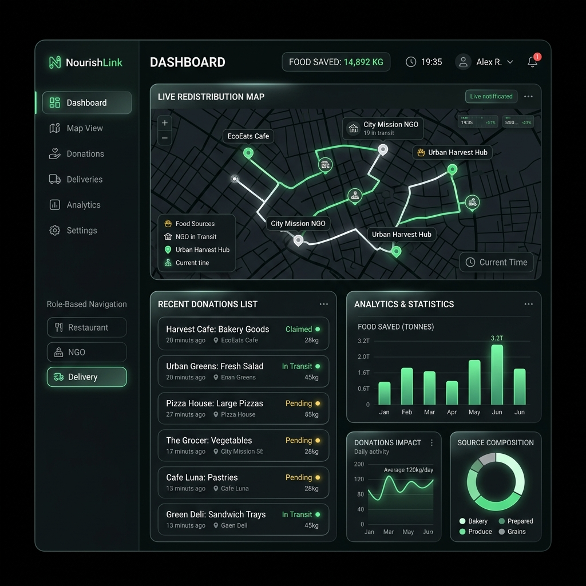
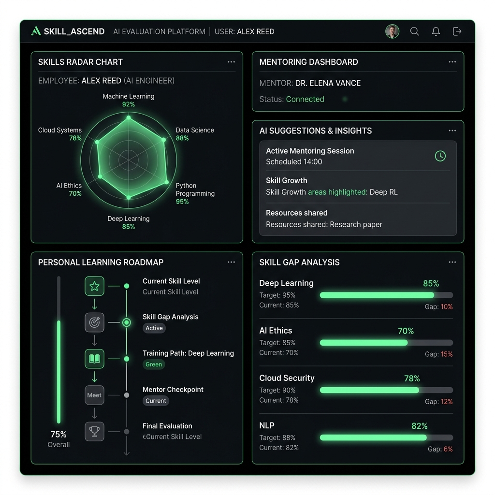
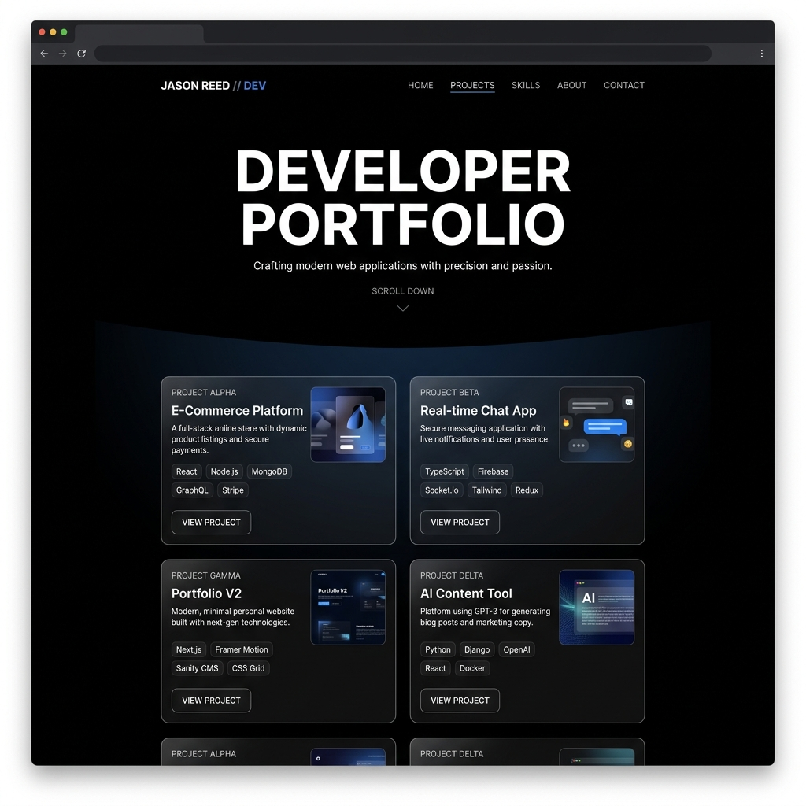

# 🌌 Futuristic Developer Portfolio V2

A premium, interactive developer portfolio built with a cinematic horizontal scroll, 3D physical simulations, responsive design, and dynamic themes.

---

## 🎯 Live Demo

🔗 **Explore the Live Site:** [portfolio-v2-eight-livid.vercel.app](https://portfolio-v2-eight-livid.vercel.app/)

---

## ✨ Features

- **🎬 Cinematic Horizontal Scroll:** Scroll vertically to drive horizontal motion. One full-screen system per frame—no grid clutter.
- **🏷️ 3D Interactive Lanyard Card:** A fully interactive, physically simulated 3D lanyard utilizing `@react-three/fiber` and `@react-three/rapier` that reacts to mouse movements and scroll events.
- **🌗 Theme Toggle:** Fluid theme transition between a sleek dark cyberpunk-esque mode and a refined, contrast-rich light mode.
- **✨ Spotlight Cursor & Micro-animations:** Premium custom cursors and scroll-triggered animations powered by GSAP and Framer Motion.
- **📦 Clean Architecture:** Production-ready TypeScript setup using Next.js App Router, complete with metadata and SEO best practices.

---

## 🛠️ Tech Stack

- **Framework:** [Next.js 15](https://nextjs.org/) (App Router)
- **Language:** [TypeScript](https://www.typescriptlang.org/)
- **Styling:** [Tailwind CSS](https://tailwindcss.com/) & Vanilla CSS
- **3D / Physics:** [Three.js](https://threejs.org/), [@react-three/fiber](https://docs.pmnd.rs/react-three-fiber), and [@react-three/rapier](https://github.com/pmndrs/react-three-rapier)
- **Animations:** [GSAP](https://greensock.com/gsap/) & [Framer Motion](https://www.framer.com/motion/)
- **Scroll Engine:** [Lenis Smooth Scroll](https://lenis.darkroom.engineering/)

---

## 🚀 Projects Showcase

Here are the key featured projects built by me:

### 1. URL SYSTEM — AI-Powered Cybersecurity Platform
An AI-powered cybersecurity platform for phishing URL, fake email, and scam detection with real-time threat scoring, featuring intelligent threat analysis with Llama 3, OCR, and AI Agents.
- **Stack:** Next.js, TypeScript, Supabase, Ollama, Llama 3, OCR, Tailwind CSS
- **Links:** [GitHub Repo](https://github.com/Abhisly/URL-SYSTEM) | [Live Demo](https://url-system.vercel.app/)

---

### 2. ZeroWaste — Smart Food Protection & Redistribution
A full-stack platform connecting restaurants, NGOs, and delivery agents with multi-portal role-based access and real-time donation workflows.
- **Stack:** React.js, Next.js, Node.js, MongoDB, MySQL, Tailwind CSS
- **Links:** [GitHub Repo](https://github.com/Abhisly/ZeroWaste) | [Live Demo](https://zero-waste-puce.vercel.app/)
- **Mockup Preview:**
  

---

### 3. AURA — Adaptive AI Skill Intelligence Platform
An AI skill evaluation system with domain-specific MCQ assessments, personalized learning roadmaps, and an immersive 3D animated mentor module.
- **Stack:** React.js, TypeScript, Node.js, MongoDB, Tailwind CSS
- **Links:** [GitHub Repo](https://github.com/Abhisly/AURA) | [Live Demo](https://aura-five-omega.vercel.app/)
- **Mockup Preview:**
  

---

### 4. Developer Portfolio Website
The interactive, premium 3D portfolio featuring immersive scroll-based storytelling, WebGL accents, and a dark premium design.
- **Stack:** Next.js, TypeScript, Tailwind CSS, Framer Motion, GSAP, Three.js, Lenis
- **Links:** [GitHub Repo](https://github.com/Abhisly/PORTFOLIO-V2/) | [Live Demo](https://portfolio-v2-eight-livid.vercel.app/)
- **Mockup Preview:**
  

---

## 💻 Getting Started

To run this portfolio locally on your machine, follow these steps:

### Prerequisites
Make sure you have **Node.js** installed (v18+ recommended).

### Installation
1. Clone the repository:
   ```bash
   git clone https://github.com/Abhisly/PORTFOLIO-V2.git
   ```
2. Navigate to the project folder:
   ```bash
   cd PORTFOLIO-V2
   ```
3. Install dependencies:
   ```bash
   npm install
   ```
4. Start the local development server:
   ```bash
   npm run dev
   ```

Open [http://localhost:3000](http://localhost:3000) in your browser to view the application.

---

## 👨‍💻 Author

**Abhi Venkat Sai**
- **Email:** [Abhixsly.pro@gmail.com](mailto:Abhixsly.pro@gmail.com)
- **LinkedIn:** [linkedin.com/in/abhisly](https://www.linkedin.com/in/abhisly)
- **GitHub:** [@Abhisly](https://github.com/Abhisly)
- **LeetCode:** [@9ZmqAzoUJT](https://leetcode.com/u/9ZmqAzoUJT/)
